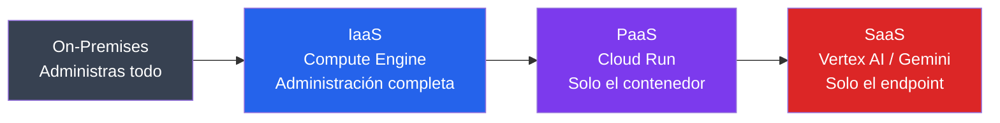

# Modelos de Servicio en la Nube

## Dependencia entre usuario y proveedor

En vez de concebir IaaS/PaaS/SaaS como tres definiciones de manual, se presentan los conceptos **un solo control deslizante**:
cuánta de la pila tecnológica administras tú y cuánta delegas en el proveedor.

Subir un escalón (IaaS → PaaS → SaaS) siempre significa lo mismo:
`menos control operativo, menos esfuerzo propio, más dependencia del proveedor`


---

## Demo: `demo.html`

### 0. Build local

```bash
docker build -t demo .

docker run -d --rm -p 8080:8080 --name demo-local demo
```

> En un proyecto previamente creado en GCP

### 1. Compute Engine (IaaS)

```bash
gcloud compute instances create vm-iaas-demo \
  --zone=us-central1-a \
  --machine-type=e2-micro \
  --image-family=debian-12 \
  --image-project=debian-cloud \
  --tags=http-server

gcloud compute firewall-rules create allow-http-demo \
  --allow=tcp:80 --target-tags=http-server --source-ranges=0.0.0.0/0

# Instalar nginx
gcloud compute ssh vm-iaas-demo --zone=us-central1-a \
  --command="sudo apt update && sudo apt install -y nginx"

# Copiar demo y reemplazar la página por defecto de nginx
gcloud compute scp demo.html vm-iaas-demo:~/index.html --zone=us-central1-a
gcloud compute ssh vm-iaas-demo --zone=us-central1-a \
  --command="sudo mv ~/index.html /var/www/html/index.html"
```

`e2-micro` está dentro del free tier de GCP (una instancia por mes, en regiones elegibles).

### 2. Cloud Run (PaaS)

El mismo archivo, empaquetado en un contenedor (`nginx:1.27`, no Alpine — ver `Dockerfile` y `default.conf` en esta carpeta).
`default.conf` redefine el puerto a `8080` porque Cloud Run espera que el contenedor escuche ahí.

```bash
# Build remoto via Cloud Build + despliegue
gcloud run deploy paas-demo \
  --source=. \
  --region=us-central1 \
  --allow-unauthenticated

# Probablemente necesita asignar algunos roles para poder usar GAR
```

### 3. Vertex AI / Gemini API (SaaS)

1. Habilitar la API: `gcloud services enable aiplatform.googleapis.com`
2. [script](vertex_demo.py) en Python

### Limpieza

```bash
# Limpieza compute engine
gcloud compute instances delete vm-iaas-demo --zone=us-central1-a
gcloud compute firewall-rules delete allow-http-demo

# limpieza cloud run y GAR
gcloud run services delete paas-demo --region=us-central1
gcloud artifacts repositories delete cloud-run-source-deploy --location=us-central1 --quiet
```
