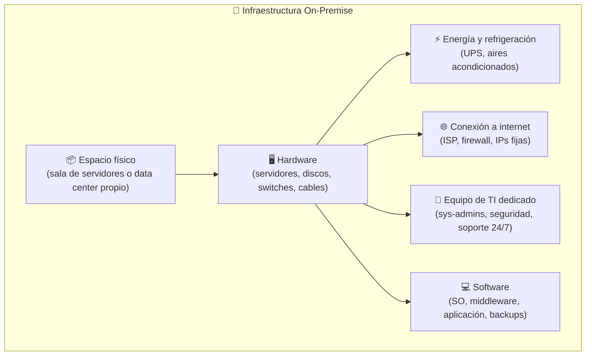
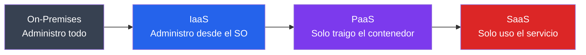
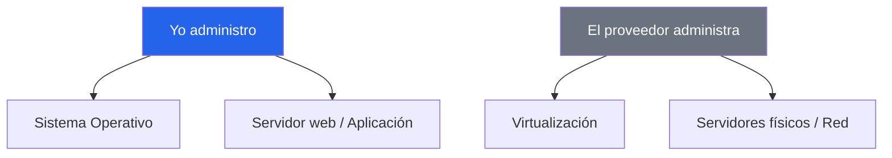
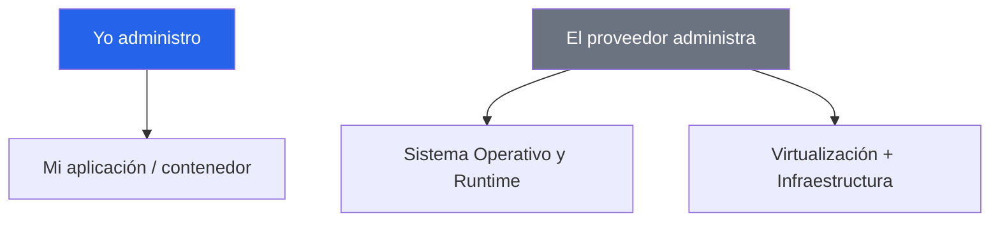
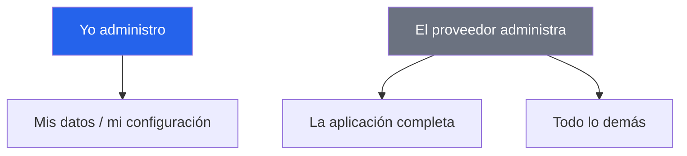
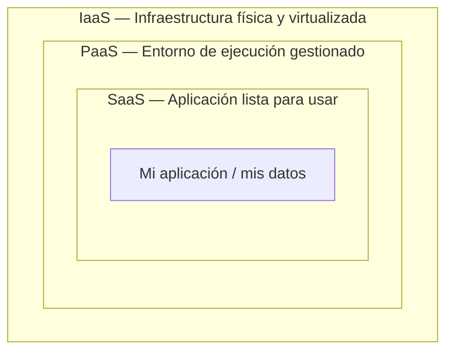

# Modelos de Servicio en la Nube: ¿cuánta nube necesito para desplegar mi software?

## ¿Qué es "la nube"?

Cuando se construye software, en algún momento se necesita que deje de vivir solo en nuestro
computador y empiece a estar **disponible para otros** — corriendo todo el tiempo,
accesible desde internet.

### Antes: infraestructura on-premise

Hasta principios de los años 2000, la manera de construir servicio basado en internet era con
infraestructura propia — a esto se le llama **on-premise** (literalmente, "en las
instalaciones físicas"). Cualquier empresa que quisiera tener un sistema disponible en internet
tenía que resolver::

El problema no era técnico — era principalment **operativo y financiero**:

| Problema | Consecuencia |
|---|---|
| Comprar el hardware por adelantado | Costo inicial enorme antes de tener un solo usuario (CapEx) |
| Capacidad fija | Si el tráfico sube, los servidores se saturan; si baja, el hardware queda ocioso |
| Escalamiento demorado | Pedir, comprar, instalar y configurar hardware nuevo no es inmediato |
| Mantenimiento 24/7 | Alguien debe dar soporte cuando se presentan problemas |
| Costo de redundancia | Para evitar un punto único de falla, hay que duplicar todo el hardware |

### Cómo nació la nube?

A mediados de los 2000, Amazon enfrentó este problema a escala masiva: construyó una
infraestructura enorme para soportar `amazon.com`, pero esa capacidad quedaba ociosa la mayor
parte del tiempo. La solución fue venderle esa capacidad sobrante a otras empresas — y en 2006
lanzó **Amazon Web Services (AWS)**, el primer servicio de infraestructura como servicio
comercial a gran escala.

La idea era simple: en vez de comprar un generador eléctrico para tu casa, te conectas a la
red eléctrica y pagas solo por lo que consumes. La nube aplicó ese mismo modelo al cómputo.

### La nube hoy

Hoy, "usar la nube" significa acceder a una red gigante de servidores interconectados,
propiedad de un proveedor -- Google, Amazon, Microsoft --, que da acceso a recursos
(cómputo, almacenamiento, red) y servicios especializados, **sin que se tenga que comprar ni mantener ese
hardware**. El proveedor resuelve el espacio, la energía, la refrigeración, la red y el hardware;
nosotros solo pagamos por lo que usamos.

Pero "usar la nube" no es una sola cosa: hay distintos niveles de cuánto hace el proveedor
por nosotros y cuánto tenemos que hacer nosotros mismos. A esos niveles los llamamos
**modelos de servicio**: IaaS, PaaS y SaaS.

---

## El problema, simplificado

Para entender estos niveles, pensemos primero en un problema que no tiene nada que ver con software:

> Quiero vender pan. Tengo tres opciones:
>
> 1. Alquilar una cocina industrial vacía y hacer todo yo mismo.
> 2. Contratar un servicio de panadería que me presta cocina, ingredientes y personal.
> 3. Simplemente comprar el pan ya horneado.

Las tres son formas válidas de "tener pan".
La diferencia es **cuánto control tengo** y **cuánto trabajo me ahorro**.

Ahora si reemplazamos "pan" por "mi aplicación corriendo": es exactamente el mismo dilema
que enfrenta cualquier equipo de ingeniería.
Eso, exactamente, es la diferencia entre **IaaS**, **PaaS** y **SaaS**.

Otras analogías equivalentes

| Analogía  | On-Premises                      | IaaS                                     | PaaS                                  | SaaS                                     |
| --------- | -------------------------------- | ---------------------------------------- | ------------------------------------- | ---------------------------------------- |
| 🍞 Pan    | Horneo todo desde cero           | Alquilo la cocina vacía                  | Panadería con personal e ingredientes | Compro el pan horneado                   |
| 🍕 Pizza  | Hago la masa desde cero en casa  | Compro masa y salsa para hornear en casa | Pizza a domicilio                     | Ceno en el restaurante                   |
| 🍝 Pasta  | Compro los ingredientes y cocino | Compro pasta y salsa hechas              | Pido comida a domicilio               | Llamo y pido el plato exacto, todo listo |

El concepto de fondo nunca cambia: **a quién le delego cada parte del trabajo**.

---

## La pila de responsabilidad

Cada modelo le entrega al proveedor **una capa más** del trabajo.

_Menos dependencia del proveedor ← &nbsp;&nbsp;&nbsp;&nbsp; → Más dependencia del proveedor_

### ¿Quién administra cada parte?

|                                   | On-Premises | IaaS         | PaaS         | SaaS         |
| --------------------------------- | ----------- | ------------ | ------------ | ------------ |
| Mi aplicación y mis datos         | 🔵 Yo       | 🔵 Yo        | 🔵 Yo        | ⚪ Proveedor  |
| El sistema operativo y el runtime | 🔵 Yo       | 🔵 Yo        | ⚪ Proveedor | ⚪ Proveedor  |
| Los servidores y la red física    | 🔵 Yo       | ⚪ Proveedor | ⚪ Proveedor | ⚪ Proveedor  |

[Tabla ampliada](http://localhost:8080/index.html)

¿Esto tiene nombre formal?

Sí — en la industria se llama **Shared Responsibility Model** (modelo de responsabilidad compartida),
y la definición de qué hace que algo sea realmente "la nube" (no solo un servidor remoto) viene del NIST:
acceso a demanda, disponible desde cualquier lugar, recursos compartidos entre varios clientes,
capacidad de crecer o reducirse automáticamente, y pago solo por lo que se usa.

---

## IaaS — Infrastructure as a Service

**La idea:** el proveedor presta la infraestructura básica (servidores virtuales, almacenamiento, red)
ya virtualizada. Yo decido qué sistema operativo usar, qué instalar, y cómo configurarlo todo.

Tipos de servicio, ventajas, desventajas y casos de uso

**Tipos de servicio típicos:** servidores virtuales (cómputo), discos/almacenamiento, redes virtuales y firewalls.

**Ventajas:** control total — se puede instalar lo que necesite, sin restricciones.

**Desventajas:** Uno es responsable de todo el mantenimiento (parches, seguridad, escalado)
— requiere más conocimiento técnico y más tiempo.

**Casos de uso típicos:** aplicaciones con requisitos muy específicos, cargas de trabajo con picos
de tráfico impredecibles, o cuando se necesita control total por temas de seguridad o cumplimiento.

**Tipos de servicios comunes:** Compute Engine (GCP), Amazon EC2 (AWS), Azure VM (Microsoft).

 

**Ejemplo:** Compute Engine (servicio de computo en GCP). Se elije sistema operativo,
se configura el servidor web, las reglas del firewall, se administran los arcivos.

---

## PaaS — Platform as a Service

**La idea:** el proveedor brinda un entorno ya listo para correr mi aplicación.
Uno solo traigo mi código (o mi contenedor); y no hay preocupaciones por las configuraciones de sistema, redes,
ni por la infrastructura.

Tipos de servicio, ventajas, desventajas y casos de uso

**Tipos de servicio típicos:** plataformas para desplegar aplicaciones (Cloud Run, App Engine)
bases de datos administradas (Cloud SQL).

**Ventajas:** menos trabajo operativo — despliegue más rápido (se puede automatizar),
no hay que instalar ni mantener servidores.

**Desventajas:** menos control sobre los detalles del entorno; si el proveedor cambia algo de la plataforma,
puede generar afectacionesafectarme.

**Casos de uso típicos:** equipos que quieren enfocarse en el código de su aplicación,
no en administrar infraestructura; proyectos que necesitan desplegar rápido y escalar sin esfuerzo manual.

**Servicios comúnes:** Heroku, AWS Elastic Beanstalk, Google App Engine, Vercel.

 

**Ejemplo en vivo:** Cloud Run (`paas-demo`) — el mismo sitio web, pero solo se precisa el contenedor.
Sin sistema operativo que elegir, sin VM, sin reglas de firewall, sin configuración de redes, sin gestión de URLs.

---

## 5. SaaS — Software as a Service

**La idea:** el proveedor me entrega una aplicación completa, lista para usar.
Uno no administra nada de infraestructura — solo se usa el servicio.

Tipos de servicio, ventajas, desventajas y casos de uso

**Tipos de servicio típicos:** aplicaciones listas para usar vía navegador o API's:
correo electrónico, almacenamiento, CRM, herramientas de IA.

**Ventajas:** cero trabajo de infraestructura; se usa de inmediato.

**Desventajas:** poco o ningún control sobre cómo funciona internamente; se depende completamente
de que el proveedor mantenga el servicio disponible y seguro.

**Casos de uso típicos:** funciones de negocio estándar que no se necesitan construir
(correo, almacenamiento de archivos, gestión de clientes, modelos de IA generativa, steaming).

**Servicios comunes:** Gmail, Dropbox, Slack, Salesforce, Notion.

**Dato curioso:** según el (reporte)[https://zylo.com/blog/saas-statistics] de Zylo SaaS Management de 2026,
una organización promedio usa de 100 a 300 aplicaciones SaaS distintas — a veces sin que el equipo de TI lo sepa.

 

**Ejemplo en vivo:** Vertex AI / Gemini API. No hay sistema operativo, ni contenedor,
ni servidor que yo pueda ver o tocar — solo un _endpoint_, una credencial, y una respuesta.

---

## 6. Los tres modelos, combinados

Ninguno vive aislado — en la práctica, se apilan uno sobre otro:

Todo lo que vimos hoy corre, en última instancia, sobre la misma infraestructura física de Google. La diferencia es **cuántas capas de esa pila decidí ver y administrar yo mismo**.

---

## Actividad: clasifica el servicio

Solución de referencia (no mostrar hasta completar el ejercicio en vivo)

| Servicio                     | Modelo      |
| ---------------------------- | ----------- |
| Gmail                        | SaaS        |
| Netflix                      | SaaS        |
| Compute Engine (VM)          | IaaS        |
| Cloud Run                    | PaaS        |
| Dropbox                      | SaaS        |
| Cloud SQL                    | PaaS        |
| Vertex AI / Gemini API       | SaaS        |
| Servidor propio en el clóset | On-Premises |

---

## El nivel de dependencia como criterio de decisión

Vimos el mismo problema —tener una app funcionando— resuelto con tres niveles distintos de dependencia del proveedor.

Ninguno es mejor que otro; cada uno responde a cuánto control necesita realmente el problema que se está resolviendo.

> "La pregunta que de verdad importa nunca es '¿qué es IaaS?' — es '¿quién se despierta a las 3 a.m. si esto se cae?'"

Nombre formal del concepto, para quien quiera profundizar

Lo que en esta clase llamamos "nivel de dependencia" se llama, formalmente, **Shared Responsibility Model**.

---

## Referencias

- Erl, T. & Monroy, E. _Cloud Computing: Concepts, Technology, Security, and Architecture_ (2nd ed.), Cap. 4 — "Fundamental Concepts and Models". Definiciones formales de IaaS/PaaS/SaaS y del modelo de responsabilidad compartida.
- NIST — 5 características esenciales de la nube.
- IBM. _"IaaS, PaaS, SaaS: What's the difference?"_ — ibm.com/think/topics/iaas-paas-saas
- Google Cloud. _"What are the different types of cloud computing?"_ — cloud.google.com/discover/types-of-cloud-computing
- Ayoadeakin234 (Medium). _"CSC 408 Cloud Computing"_, Weeks 1, 2 y 4 — notas de clase y analogías didácticas.
