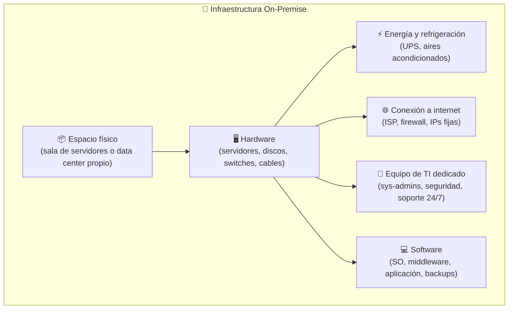
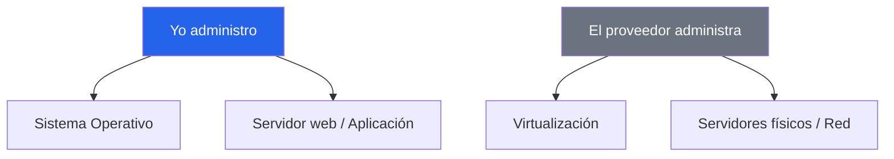
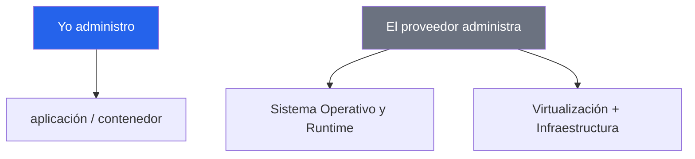
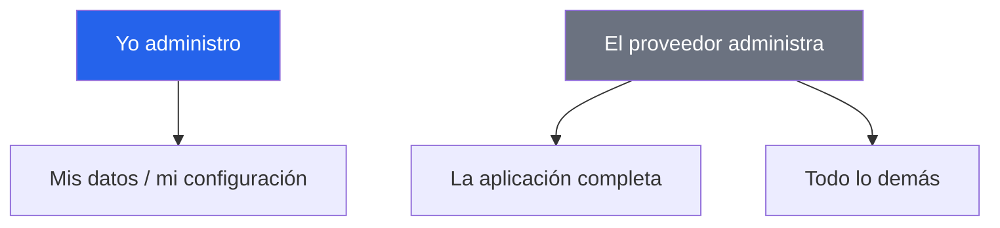
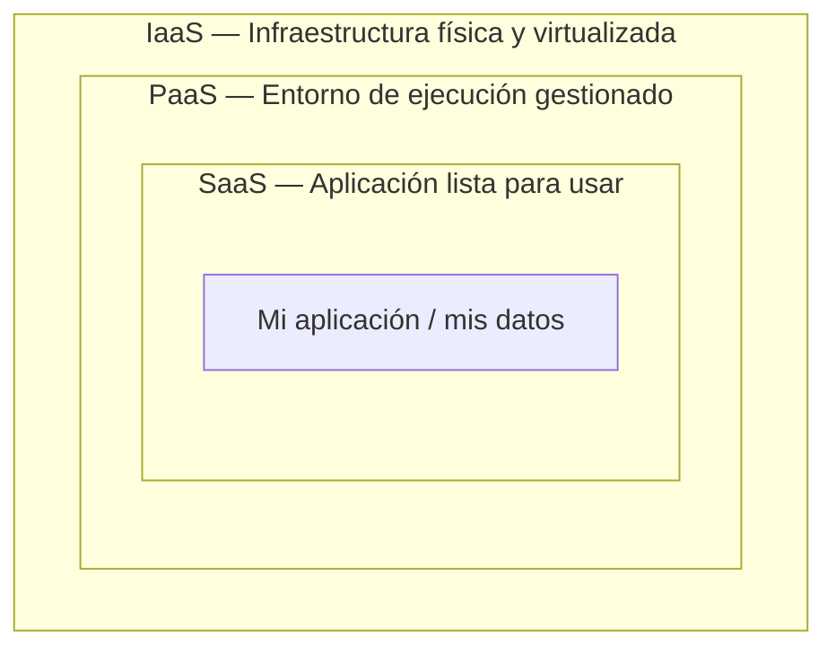

# Modelos de Servicio en la Nube: ¿cuánta nube necesito para desplegar mi software?

## Contenido

1. [¿Para qué usamos "la nube"?](#) — Contexto general de la nube
2. [La pila de responsabilidad](#) — Quién administra qué en cada modelo
3. [IaaS](#) — Compute Engine (GCP)
4. [PaaS](#) — Cloud Run (GCP)
5. [SaaS](#) — Gemini API (GCP)
6. [Actividad: clasifica el servicio](#) Cierre

## ¿Para qué usamos "la nube"?

Cuando se construye software, en algún momento se necesita que deje de vivir solo en nuestro
computador y empiece a estar **disponible para otros** — corriendo todo el tiempo,
accesible desde internet.

### Antes: infraestructura on-premise

Hasta principios de los años 2000, la manera de construir servicio basado en internet era con
infraestructura propia — a esto se le llama **on-premise** (literalmente, "en las
instalaciones físicas"). Cualquier empresa que quisiera tener un sistema disponible en internet
tenía que resolver:

El problema no era técnico — era principalmente **operativo y financiero**:

| Problema |
|---------------------------------------------|
| Comprar el hardware por adelantado -> CaExp |
| Capacidad fija -> Infra ociosa |
| Escalamiento demorado -> Requiere recursos |
| Mantenimiento 24/7 -> Soporte |

### ¿Cómo nació la nube?

A mediados de los 2000, Amazon enfrentó este problema a escala masiva: construyó una
infraestructura enorme para soportar `amazon.com`, pero esa capacidad quedaba ociosa la mayor
parte del tiempo. La solución fue venderle esa capacidad sobrante a otras empresas — y en 2006
lanzó **Amazon Web Services (AWS)**, el primer servicio de infraestructura como servicio
comercial a gran escala.

### La nube al día de hoy

Hoy en día, "usar la nube" significa `acceder a una red gigante de servidores interconectados
que proporciona recursos` y son propiedad de un proveedor, el cual se ocupa de todo y nosotros solo
pagamos por lo que usamos.

Pero "usar la nube" no es solo pagar, hay distintos niveles de cuánto hace el proveedor
y cuánto tenemos que hacer nosotros mismos. Esto se conoce como **modelos de servicio**: IaaS, PaaS y SaaS.

---

## El problema, simplificado

Para entender los niveles de servicio, consideremos:

> Quiero vender pan. Hay tres opciones:
>
> 1. Alquilar una cocina vacía y hacer todo yo mismo.
> 2. Contratar un servicio de panadería con ingredientes y personal.
> 3. Simplemente comprar el pan ya horneado.

Las tres son formas válidas de "tener pan" para venderlo.
La diferencia es **cuánto control tengo** y **cuánto trabajo me ahorro**.

Ahora al reemplazar "pan" por "mi aplicación en la nube": es la misma elección del modelo de servicio.
Eso, exactamente, es la diferencia entre **IaaS**, **PaaS** y **SaaS**.

Otras analogías equivalentes

| Analogía  | On-Premises                      | IaaS                                     | PaaS                                  | SaaS                                     |
| --------- | -------------------------------- | ---------------------------------------- | ------------------------------------- | ---------------------------------------- |
| 🍞 Pan    | Horneo todo desde cero           | Alquilo la cocina vacía                  | Panadería con personal e ingredientes | Compro el pan horneado                   |
| 🍕 Pizza  | Hago la masa desde cero en casa  | Compro masa y salsa para hornear en casa | Pizza a domicilio                     | Ceno en el restaurante                   |
| 🍝 Pasta  | Compro los ingredientes y cocino | Compro pasta y salsa hechas              | Pido comida a domicilio               | Llamo y pido el plato exacto, todo listo |

---

## La pila de responsabilidad

Cada modelo le entrega al proveedor **una capa más** del trabajo.

|                                   | On-Premises | IaaS         | PaaS         | SaaS         |
| --------------------------------- | ----------- | ------------ | ------------ | ------------ |
| Mi aplicación y mis datos         | 🔵 Yo       | 🔵 Yo        | 🔵 Yo        | ⚪ Proveedor  |
| El sistema operativo y el runtime | 🔵 Yo       | 🔵 Yo        | ⚪ Proveedor | ⚪ Proveedor  |
| Los servidores y la red física    | 🔵 Yo       | ⚪ Proveedor | ⚪ Proveedor | ⚪ Proveedor  |

[Tabla ampliada](http://localhost:8080/index.html)

Definiciones formales

En la industria se llama **Shared Responsibility Model** (modelo de responsabilidad compartida),
asimismo el NIST establece los requisitos para estar en la nube: acceso a demanda, disponibilidad desde cualquier lugar, recursos compartidos, capacidad de crecer o reducirse automáticamente (elasticidad), y pago solo por lo que se usa.

---

## IaaS — Infrastructure as a Service

**Concepto:** el proveedor presta la infraestructura básica (servidores virtuales, almacenamiento, red)
ya virtualizada. Yo decido qué sistema operativo usar, qué instalar, y cómo configurarlo todo.

Resumen

- **Servicios:** servidores virtuales (cómputo), discos/almacenamiento, redes virtuales y firewalls.
- **Pros:** control total.
- **Contras:** responsabilidad del mantenimiento (parches, seguridad), necesidad de conocimiento.
- **Casos de uso:** aplicaciones especificass, cargas de trabajo con picos.
- **Ejemplos:** Compute Engine (GCP), Amazon EC2 (AWS), Azure VM (Microsoft).

 

**Ejemplo:** Compute Engine (servicio de computo en GCP). Se elije sistema operativo,
se configura el servidor web, las reglas del firewall, se administran los arcivos.

---

## PaaS — Platform as a Service

**Concepto:** el proveedor brinda un entorno ya listo para correr la aplicación.
Uno solo trae el código; y no hay preocupaciones por las configuraciones de sistema, redes,
ni por la infrastructura.

Resumen

- **Servicios:** plataformas para desplegar aplicaciones (Cloud Run, App Engine)
bases de datos administradas (Cloud SQL).
- **Pros:** menos trabajo operativo — despliegue rapido y automatizable, bajo mantenimiento.
- **Contras:** menos control, cambios del proveedor pueden geenerar afectaciones.
- **Casos de uso:** equipos enfocados en el desarrollo, no en administrar infraestructura;
proyectos que necesitan desplegar rápido y escalar sin esfuerzo manual.
- **Ejemplos:** Heroku, Google App Engine, Vercel.

 

**Ejemplo en vivo:** Cloud Run (`paas-demo`) — el mismo sitio web, pero solo se precisa el contenedor.
Sin sistema operativo que elegir, sin VM, sin reglas de firewall, sin configuración de redes, sin gestión de URLs.

---

## 5. SaaS — Software as a Service

**Concepto:** el proveedor entrega una aplicación completa, lista para usar.
Uno no administra nada de infraestructura — solo se usa el servicio.

Resumen

- **Servicios:** aplicaciones listas para usar (navegador o API's):
correo electrónico, almacenamiento, CRM, herramientas de IA.
- **Pros:** cero trabajo de infraestructura; se usa de inmediato.
- **Contras:** caja gris; dependencia total del proveedor.
- **Casos de uso:** funciones de negocio estándar (correo, almacenamiento de archivos, gestión de clientes, modelos de IA generativa, streaming).
**Servicios comunes:** Gmail, Dropbox, Slack, Salesforce, Notion.

**Dato curioso:** según el (reporte)[https://zylo.com/blog/saas-statistics] de Zylo SaaS Management de 2026,
una organización promedio usa de 100 a 300 aplicaciones SaaS distintas — a veces sin que el equipo de TI lo sepa.

 

**Ejemplo en vivo:** Vertex AI / Gemini API. No hay sistema operativo, ni contenedor,
ni servidor que yo pueda ver o tocar — solo un _endpoint_, una credencial, y una respuesta.

---

## 6. Los tres modelos, combinados

Ninguno vive aislado — en la práctica, se apilan uno sobre otro:

Todo lo que vimos hoy corre, en última instancia, sobre la misma infraestructura física del proveedor.
La diferencia es **cuántas capas de esa pila decidí ver y administrar yo mismo**.

---

## Actividad: clasifica el servicio

Solución de referencia (no mostrar hasta completar el ejercicio en vivo)

| Servicio                     | Modelo      |
| ---------------------------- | ----------- |
| Gmail                        | SaaS        |
| Netflix                      | SaaS        |
| Compute Engine (VM)          | IaaS        |
| Cloud Run                    | PaaS        |
| Dropbox                      | SaaS        |
| Cloud SQL                    | PaaS        |
| Vertex AI / Gemini API       | SaaS        |
| Servidor propio en el clóset | On-Premises |

---

## El nivel de dependencia como criterio de decisión

Vimos el mismo problema —tener una app funcionando— resuelto con tres niveles distintos de dependencia del proveedor.
Ninguno es mejor que otro; cada uno responde a cuánto control necesita realmente el problema que se está resolviendo.

> "La pregunta que de verdad importa nunca es '¿qué es IaaS?' — es '¿quién se despierta a las 3 a.m. si esto se cae?'"
---

Resumen

- La nube es un conjunto de servidores interconectados que ofrece variadad de servicios para desplegar
aplicaciones contectadas a internet.
- Para acceder a la nube ser cuenta con tres modelos de accesso a servicios.
- IaaS: Se proprorciona acceso a recuersos virtualziados, el usuario debe configurar y mantener.
- PaaS: Se propociana un entorno listo para desplegar aplciaciones, el suaurio solo se preocupa por el código.
- SaaS: Se proporciona una palicacioón completamente admisnitrada por el proveedor, el usuario solo ocupa el servicio.
- El modelo de responsabilidad compartida define qué le corresponde administrar al proveedor y qué al usuario.

## Referencias

- Erl, T. & Monroy, E. _Cloud Computing: Concepts, Technology, Security, and Architecture_ (2nd ed.), Cap. 4 — "Fundamental Concepts and Models". Definiciones formales de IaaS/PaaS/SaaS y del modelo de responsabilidad compartida.
- NIST — 5 características esenciales de la nube.
- IBM. _"IaaS, PaaS, SaaS: What's the difference?"_ — ibm.com/think/topics/iaas-paas-saas
- Google Cloud. _"What are the different types of cloud computing?"_ — cloud.google.com/discover/types-of-cloud-computing
- Ayoadeakin234 (Medium). _"CSC 408 Cloud Computing"_, Weeks 1, 2 y 4 — notas de clase y analogías didácticas.
